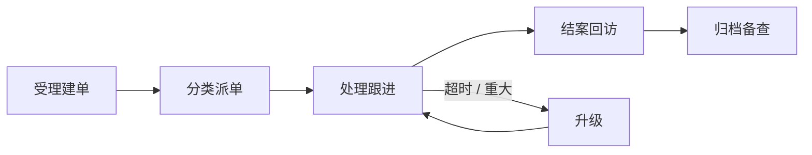
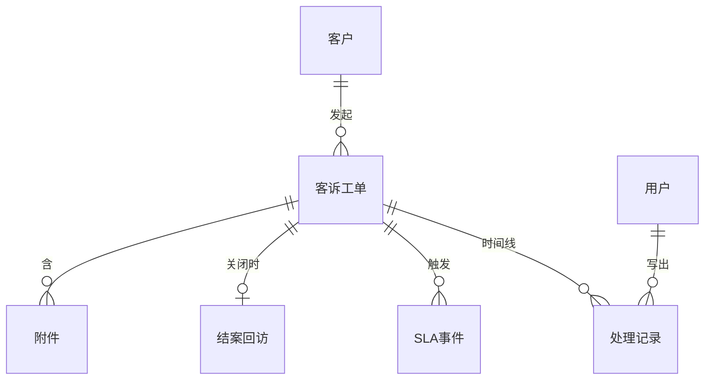

客诉从进线到归档的全部处理内容都留痕。写法同内容练习：同一步用共用 `###` 聚拢；流程 / 界面 / 兜底分小节；实体按表整表写在步骤之后；一块正文只归属一个透镜。

{#202608061101}
## 处理一条客诉

{#202608061180}
客诉进线后，事实、沟通、方案、协同与结案常散落在聊天和表格里，事后无法回放「谁在何时做了什么」。

{#202608061102}


{#202608061107}
### 受理建单

{#202608061120}
| 人填写 / 操作 | 系统动作 |
| --- | --- |
| 选渠道；查客户（手机 / 会员号 / 邮箱）；填联系人快照 | 命中则带出档案与近 90 天工单数；联系方式写入本单快照 |
| 填发生时间、关联单号（可空）、问题描述、诉求与附件 | 校验关联对象；描述原文入库；附件挂受理记录 |
| 选问题类型、紧急度；勾 VIP / 舆情 | 写入分类定级；驱动 SLA；重大 / 舆情可通知主管 |
| 确认提交 / 存草稿 | 提交：生成工单号、写主档、追加 `intake` 记录、入队或直派、启动响应 SLA。草稿：不占号、不启动 SLA |

{#202608061121}
:::details UI
```wireframe
@frame 新建客诉 · 渠道与客户
渠道 [电话 ▼]
客户手机 / 会员号
@btn 查找客户
联系人 · 联系电话
@btn 下一步

@frame 新建客诉 · 投诉内容
发生时间 · 关联订单号
问题描述 · 客户诉求
附件上传
@btn 上一步 · 下一步

@frame 新建客诉 · 分类定级
问题类型 · 紧急度
☐ 舆情  ☐ VIP
SLA 预览（只读）
@btn 上一步 · 下一步

@frame 新建客诉 · 确认提交
摘要（只读）
@btn 存草稿 · 提交建单
```
:::

{#202608061122}
| 情况 | 表现 | 人接下来能做什么 |
| --- | --- | --- |
| 客户未命中 | 提示将随建单建档 | 补全姓名与联系方式后继续 |
| 必填未选 / 描述为空或过长 | 字段红字或提示 | 补全或精简；过长改附件 |
| 关联订单号不存在 | 「找不到该订单」 | 改单号或清空 |
| 附件超限 / 类型不允许 | 上传失败 | 换文件或压缩 |
| 提交失败 / 连点 | 错误条或按钮禁用；保留表单 | 重试；不产生半成品正式单 |
| 中途关闭未存草稿 | 内容丢失 | 重填或从草稿续填 |

{#202608061108}
### 分类派单

{#202608061123}
| 人 / 规则 | 系统动作 |
| --- | --- |
| 按问题类型、紧急度、VIP、责任组规则派单 | 写入责任人 / 责任组；追加派单记录；通知处理人 |
| 主管手动改派 | 变更责任人；追加转派记录；处理 SLA 默认不重置 |

{#202608061124}
:::details UI
```wireframe
@frame 派单队列
筛选：类型 · 紧急度 · SLA
工单列表
@btn 自动派单规则 · 手动指派
```
:::

{#202608061125}
| 情况 | 表现 | 人接下来能做什么 |
| --- | --- | --- |
| 无匹配责任组 | 留在待派单并告警 | 主管指定或补规则 |
| 指派对象停用 | 字段错误 | 改选他人 |

{#202608061109}
### 处理跟进

{#202608061126}
| 人操作 | 系统动作 |
| --- | --- |
| 接单 / 退回队列 | 责任人变更；状态 `in_progress` / `open`；写接单或退回记录；首次响应打响应 SLA 达标点 |
| 内部备注 / 对客回复 / 核查纪要 | 追加处理记录（可见性 internal 或 customer）；可挂附件、引用订单等 ID |
| 转办 / 加签 / 挂起 | 写 transfer / countersign / hold；加签人可写记录不可独自结案；挂起可暂停处理 SLA |
| 登记方案与执行；手动升级 | 写 plan / action / escalate；主档方案摘要可覆盖，记录不覆盖；SLA 超时系统自动升级并标红 |

硬约束：禁止只改主档结论不写记录；误写不可改历史，用新记录更正并引用原记录。

记录类型：`intake` / `accept` / `release` / `note` / `reply` / `transfer` / `countersign` / `hold` / `resume` / `escalate` / `plan` / `action` / `resolve_request` / `system`。

{#202608061127}
:::details UI
```wireframe
@frame 工单详情 · 待接单
工单号 · 紧急度 · SLA
问题描述（只读）· 时间线
@btn 接单 · 退回队列

@frame 工单详情 · 处理
左侧：主档 · SLA
右侧：时间线
类型 [内部备注 ▼] 可见性 ○内部 ○对客
正文 · 附件
@btn 添加记录
@btn 转办 · 加签 · 挂起 · 提请结案

@frame 方案与执行
方案摘要 · 执行结果 · 凭证
@btn 保存方案 · 保存执行结果 · 升级主管
```
:::

{#202608061128}
| 情况 | 表现 | 人接下来能做什么 |
| --- | --- | --- |
| 已被他人接单 | 提示并只读 | 关闭或申请转办 |
| 响应 / 处理超时 | 顶栏标红；可继续写记录 | 优先处理或升级 |
| 记录正文为空 / 对客含敏感信息 | 拦截 | 补正文或改内部备注 |
| 误写记录 | 不允许改历史 | 追加更正并引用原记录 |
| 转办给自己 / 对象停用 / 挂起无原因 | 提示错误 | 改选或补原因 |
| 无方案就提请结案 / 重大单未升级 | 拦截 | 先补 plan/action 或升级 |
| 通知失败 | 记录仍保存；标通知失败 | 重发或改渠道 |

{#202608061110}
### 结案回访

{#202608061129}
| 人 / 客户操作 | 系统动作 |
| --- | --- |
| 提请结案：关闭原因、对客说明、内部备注 | 校验至少一条 plan/action（重大单需主管已介入）；写 `resolve_request` |
| 客户认可 / 仍未解决 | 认可→回访；驳回→`in_progress` 并通知处理人（不删提请记录） |
| 超时未响应 / 主管强制结案 | 按规则自动确认或强制关闭；写 system / 强制原因 |
| 评分 1–5 或跳过回访 | 写满意度（可空）；状态 `closed`；主档只读；停 SLA |

{#202608061130}
:::details UI
```wireframe
@frame 提请结案
关闭原因 · 对客说明 · 内部备注
@btn 取消 · 提请结案

@frame 客户 · 结案确认
结案说明
@btn 认可结案 · 仍未解决

@frame 回访
满意度 ★★★★☆ · 评语
@btn 提交 · 跳过
```
:::

{#202608061131}
| 情况 | 表现 | 人接下来能做什么 |
| --- | --- | --- |
| 缺方案 / 执行或重大单未升级 | 拦截并列出缺失项 | 回处理补记录 |
| 结案说明为空 / 驳回无原因 | 字段红字 | 补说明 |
| 强制结案无权限 | 拒绝 | 找主管 |
| 确认通知失败 | 仍待确认 | 重发或代操作（须写代操作记录） |

{#202608061111}
### 归档备查

{#202608061132}
| 人操作 | 系统动作 |
| --- | --- |
| 只读查阅、导出时间线 | 完整回放受理→处理→结案；作废仅主管且须原因，记录保留 |
| 质检复盘备注 / 关联改进单 | 仅追加 note；主档事实字段不可改 |

{#202608061133}
:::details UI
```wireframe
@frame 已关闭工单（只读）
状态：已关闭
完整时间线
@btn 导出记录
```
:::

{#202608061134}
| 情况 | 表现 | 人接下来能做什么 |
| --- | --- | --- |
| 关闭后想改结论 | 主档拒绝编辑 | 新单关联旧单，或主管授权重开（写 system 记录） |
| 处理人离职仍有待确认单 | 主管接管 | 改派后继续 |

{#202608061150}
### 实体

{#202608061151}
:::details E-R

:::

{#202608061152}
:::details customers
| 字段 | 标识 | 类型 | 约束 |
| --- | --- | --- | --- |
| 客户 ID | customer_id | 文本 | 必填，系统生成 |
| 姓名 | name | 文本 | 必填，≤64 |
| 手机 | phone | 文本 | 可空，≤20 |
| 邮箱 | email | 文本 | 可空，≤254 |
| 会员号 | member_no | 文本 | 可空，≤32 |
| 客户等级 | tier | 枚举 | 必填：normal / vip / svip |

| 索引 | 字段 | 说明 |
| --- | --- | --- |
| 主键 | customer_id | |
| 唯一 | phone | 非空时唯一 |
| 唯一 | member_no | 非空时唯一 |
:::

{#202608061153}
:::details complaints
| 字段 | 标识 | 类型 | 约束 |
| --- | --- | --- | --- |
| 工单号 | complaint_id | 文本 | 必填，提交时生成 |
| 客户 | customer_id | 引用 客户 | 必填 |
| 渠道 | channel | 枚举 | 必填：phone / email / wechat / app / store / other |
| 联系人快照 | contact_name | 文本 | 必填，≤64 |
| 联系方式快照 | contact_phone | 文本 | 必填，≤20 |
| 发生时间 | occurred_at | 时间 | 可空 |
| 关联单号 | ref_order_no | 文本 | 可空，≤64 |
| 问题描述 | description | 长文本 | 必填 |
| 客户诉求 | demand | 枚举 | 必填：refund / replace / apology / other |
| 诉求说明 | demand_note | 文本 | 可空，≤500 |
| 问题类型 | category | 枚举 | 必填：quality / logistics / attitude / billing / other |
| 紧急度 | urgency | 枚举 | 必填：normal / urgent / critical |
| 舆情标记 | public_risk | 布尔 | 默认 false |
| 状态 | status | 枚举 | 必填：draft / open / in_progress / pending_customer / resolved / closed / void |
| 责任人 | assignee_id | 引用 用户 | 可空 |
| 受理人 | created_by | 引用 用户 | 必填 |
| 响应 SLA 截止 | respond_due_at | 时间 | 正式单必填 |
| 处理 SLA 截止 | resolve_due_at | 时间 | 正式单必填 |
| 创建时间 | created_at | 时间 | 必填 |
| 更新时间 | updated_at | 时间 | 必填 |

| 索引 | 字段 | 说明 |
| --- | --- | --- |
| 主键 | complaint_id | |
| 普通 | status, assignee_id | 队列查询 |
| 普通 | customer_id, created_at | 客户历史 |
:::

{#202608061154}
:::details handling_records
| 字段 | 标识 | 类型 | 约束 |
| --- | --- | --- | --- |
| 记录 ID | record_id | 文本 | 必填 |
| 工单 | complaint_id | 引用 客诉工单 | 必填 |
| 类型 | type | 枚举 | 必填 |
| 可见性 | visibility | 枚举 | 必填：internal / customer |
| 正文 | body | 长文本 | 按类型必填 |
| 操作人 | actor_id | 引用 用户 | 系统记录可空 |
| 转交对象 | target_user_id | 引用 用户 | 可空 |
| 引用记录 | corrects_id | 引用 处理记录 | 可空 |
| 创建时间 | created_at | 时间 | 必填，只写一次 |

| 索引 | 字段 | 说明 |
| --- | --- | --- |
| 主键 | record_id | |
| 普通 | complaint_id, created_at | 时间线 |
:::

{#202608061155}
:::details sla_events
| 字段 | 标识 | 类型 | 约束 |
| --- | --- | --- | --- |
| 事件 ID | event_id | 文本 | 必填 |
| 工单 | complaint_id | 引用 客诉工单 | 必填 |
| 种类 | kind | 枚举 | 必填：respond_due / resolve_due / escalated |
| 计划时刻 | due_at | 时间 | 必填 |
| 实际时刻 | happened_at | 时间 | 可空 |
| 结果 | result | 枚举 | 可空：met / breached / escalated |

| 索引 | 字段 | 说明 |
| --- | --- | --- |
| 主键 | event_id | |
| 普通 | complaint_id, kind | |
:::

{#202608061156}
:::details closures
| 字段 | 标识 | 类型 | 约束 |
| --- | --- | --- | --- |
| 结案 ID | closure_id | 文本 | 必填 |
| 工单 | complaint_id | 引用 客诉工单 | 必填，唯一 |
| 关闭原因 | reason | 枚举 | 必填：resolved / unmet / duplicate / invalid |
| 对客说明 | summary | 文本 | 必填，≤1000 |
| 客户确认 | customer_ack | 枚举 | 必填：accepted / rejected / timeout / forced |
| 确认时间 | acked_at | 时间 | 可空 |
| 满意度 | score | 整数 | 可空，1–5 |
| 评语 | comment | 文本 | 可空，≤500 |
| 结案操作人 | closed_by | 引用 用户 | 必填 |
| 结案时间 | closed_at | 时间 | 必填 |

| 索引 | 字段 | 说明 |
| --- | --- | --- |
| 主键 | closure_id | |
| 唯一 | complaint_id | |
:::

{#202608061160}
### 权限

{#202608061161}
| 角色 | 能做什么 |
| --- | --- |
| 受理员 | 建单、编辑自己的草稿、查看自己创建的工单（对客记录） |
| 处理人 | 接单、写记录、转办 / 加签 / 挂起、提请结案 |
| 加签人 | 写记录；不可转办主责、不可独自结案 |
| 主管 | 改派、升级、强制结案、重开、导出、看组内全部含 internal |
| 质检 | 只读归档 + 复盘备注 |
| 客户 | 自助提交、看进度摘要、确认 / 驳回结案、评满意度 |

越权拒绝并写审计。

{#202608061170}
### 全程兜底

{#202608061171}
| 情况 | 约定 |
| --- | --- |
| 工单已结案 | 主档只读；禁止改事实字段；仅质检可追加复盘备注 |
| 重复投诉 | 可关联历史工单，但新建独立工单 |
| 删除 | 只允许「作废」；记录与附件保留 |
| 渠道原文 | 导入保留原文快照；编辑摘要不改原文 |
| 正式提交前 | 不占工单号、不启动 SLA |
| 网络失败 | 页内错误条，保留已填；可重试 |
