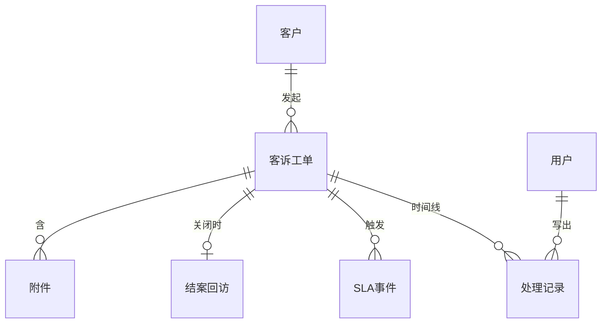

{#202608061151}
:::details E-R

:::

{#202608061152}
:::details customers
| 字段 | 标识 | 类型 | 约束 |
| --- | --- | --- | --- |
| 客户 ID | customer_id | 文本 | 必填，系统生成 |
| 姓名 | name | 文本 | 必填，≤64 |
| 手机 | phone | 文本 | 可空，≤20 |
| 邮箱 | email | 文本 | 可空，≤254 |
| 会员号 | member_no | 文本 | 可空，≤32 |
| 客户等级 | tier | 枚举 | 必填：normal / vip / svip |

| 索引 | 字段 | 说明 |
| --- | --- | --- |
| 主键 | customer_id | |
| 唯一 | phone | 非空时唯一 |
| 唯一 | member_no | 非空时唯一 |
:::

{#202608061153}
:::details complaints
| 字段 | 标识 | 类型 | 约束 |
| --- | --- | --- | --- |
| 工单号 | complaint_id | 文本 | 必填，提交时生成 |
| 客户 | customer_id | 引用 客户 | 必填 |
| 渠道 | channel | 枚举 | 必填：phone / email / wechat / app / store / other |
| 联系人快照 | contact_name | 文本 | 必填，≤64 |
| 联系方式快照 | contact_phone | 文本 | 必填，≤20 |
| 发生时间 | occurred_at | 时间 | 可空 |
| 关联单号 | ref_order_no | 文本 | 可空，≤64 |
| 问题描述 | description | 长文本 | 必填 |
| 客户诉求 | demand | 枚举 | 必填：refund / replace / apology / other |
| 诉求说明 | demand_note | 文本 | 可空，≤500 |
| 问题类型 | category | 枚举 | 必填：quality / logistics / attitude / billing / other |
| 紧急度 | urgency | 枚举 | 必填：normal / urgent / critical |
| 舆情标记 | public_risk | 布尔 | 默认 false |
| 状态 | status | 枚举 | 必填：draft / open / in_progress / pending_customer / resolved / closed / void |
| 责任人 | assignee_id | 引用 用户 | 可空 |
| 受理人 | created_by | 引用 用户 | 必填 |
| 响应 SLA 截止 | respond_due_at | 时间 | 正式单必填 |
| 处理 SLA 截止 | resolve_due_at | 时间 | 正式单必填 |
| 创建时间 | created_at | 时间 | 必填 |
| 更新时间 | updated_at | 时间 | 必填 |

| 索引 | 字段 | 说明 |
| --- | --- | --- |
| 主键 | complaint_id | |
| 普通 | status, assignee_id | 队列查询 |
| 普通 | customer_id, created_at | 客户历史 |
:::

{#202608061154}
:::details handling_records
| 字段 | 标识 | 类型 | 约束 |
| --- | --- | --- | --- |
| 记录 ID | record_id | 文本 | 必填 |
| 工单 | complaint_id | 引用 客诉工单 | 必填 |
| 类型 | type | 枚举 | 必填 |
| 可见性 | visibility | 枚举 | 必填：internal / customer |
| 正文 | body | 长文本 | 按类型必填 |
| 操作人 | actor_id | 引用 用户 | 系统记录可空 |
| 转交对象 | target_user_id | 引用 用户 | 可空 |
| 引用记录 | corrects_id | 引用 处理记录 | 可空 |
| 创建时间 | created_at | 时间 | 必填，只写一次 |

| 索引 | 字段 | 说明 |
| --- | --- | --- |
| 主键 | record_id | |
| 普通 | complaint_id, created_at | 时间线 |
:::

{#202608061155}
:::details sla_events
| 字段 | 标识 | 类型 | 约束 |
| --- | --- | --- | --- |
| 事件 ID | event_id | 文本 | 必填 |
| 工单 | complaint_id | 引用 客诉工单 | 必填 |
| 种类 | kind | 枚举 | 必填：respond_due / resolve_due / escalated |
| 计划时刻 | due_at | 时间 | 必填 |
| 实际时刻 | happened_at | 时间 | 可空 |
| 结果 | result | 枚举 | 可空：met / breached / escalated |

| 索引 | 字段 | 说明 |
| --- | --- | --- |
| 主键 | event_id | |
| 普通 | complaint_id, kind | |
:::

{#202608061156}
:::details closures
| 字段 | 标识 | 类型 | 约束 |
| --- | --- | --- | --- |
| 结案 ID | closure_id | 文本 | 必填 |
| 工单 | complaint_id | 引用 客诉工单 | 必填，唯一 |
| 关闭原因 | reason | 枚举 | 必填：resolved / unmet / duplicate / invalid |
| 对客说明 | summary | 文本 | 必填，≤1000 |
| 客户确认 | customer_ack | 枚举 | 必填：accepted / rejected / timeout / forced |
| 确认时间 | acked_at | 时间 | 可空 |
| 满意度 | score | 整数 | 可空，1–5 |
| 评语 | comment | 文本 | 可空，≤500 |
| 结案操作人 | closed_by | 引用 用户 | 必填 |
| 结案时间 | closed_at | 时间 | 必填 |

| 索引 | 字段 | 说明 |
| --- | --- | --- |
| 主键 | closure_id | |
| 唯一 | complaint_id | |
:::
