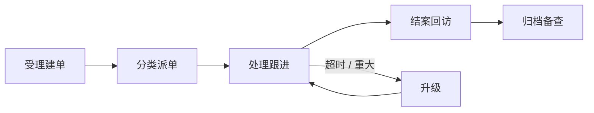

{#202608061102}

{#202608061119}
| 人 / 操作 | 系统动作 | {#202608061135}
| --- | --- | --- |
| 选渠道；查客户（手机 / 会员号 / 邮箱）；填联系人快照 | 命中则带出档案与近 90 天工单数；联系方式写入本单快照 |{#202608061120}
| 填发生时间、关联单号（可空）、问题描述、诉求与附件 | 校验关联对象；描述原文入库；附件挂受理记录 | |
| 选问题类型、紧急度；勾 VIP / 舆情 | 写入分类定级；驱动 SLA；重大 / 舆情可通知主管 | |
| 确认提交 / 存草稿 | 提交：生成工单号、写主档、追加 `intake` 记录、入队或直派、启动响应 SLA。草稿：不占号、不启动 SLA | |
| 按问题类型、紧急度、VIP、责任组规则派单 | 写入责任人 / 责任组；追加派单记录；通知处理人 |{#202608061123}
| 主管手动改派 | 变更责任人；追加转派记录；处理 SLA 默认不重置 | |
| 接单 / 退回队列 | 责任人变更；状态 `in_progress` / `open`；写接单或退回记录；首次响应打响应 SLA 达标点 |{#202608061126}
| 内部备注 / 对客回复 / 核查纪要 | 追加处理记录（可见性 internal 或 customer）；可挂附件、引用订单等 ID | |
| 转办 / 加签 / 挂起 | 写 transfer / countersign / hold；加签人可写记录不可独自结案；挂起可暂停处理 SLA | |
| 登记方案与执行；手动升级 | 写 plan / action / escalate；主档方案摘要可覆盖，记录不覆盖；SLA 超时系统自动升级并标红 | |
| 提请结案：关闭原因、对客说明、内部备注 | 校验至少一条 plan/action（重大单需主管已介入）；写 `resolve_request` |{#202608061129}
| 客户认可 / 仍未解决 | 认可→回访；驳回→`in_progress` 并通知处理人（不删提请记录） | |
| 超时未响应 / 主管强制结案 | 按规则自动确认或强制关闭；写 system / 强制原因 | |
| 评分 1–5 或跳过回访 | 写满意度（可空）；状态 `closed`；主档只读；停 SLA | |
| 只读查阅、导出时间线 | 完整回放受理→处理→结案；作废仅主管且须原因，记录保留 |{#202608061132}
| 质检复盘备注 / 关联改进单 | 仅追加 note；主档事实字段不可改 | |

硬约束：禁止只改主档结论不写记录；误写不可改历史，用新记录更正并引用原记录。

记录类型：`intake` / `accept` / `release` / `note` / `reply` / `transfer` / `countersign` / `hold` / `resume` / `escalate` / `plan` / `action` / `resolve_request` / `system`。
