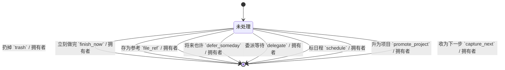
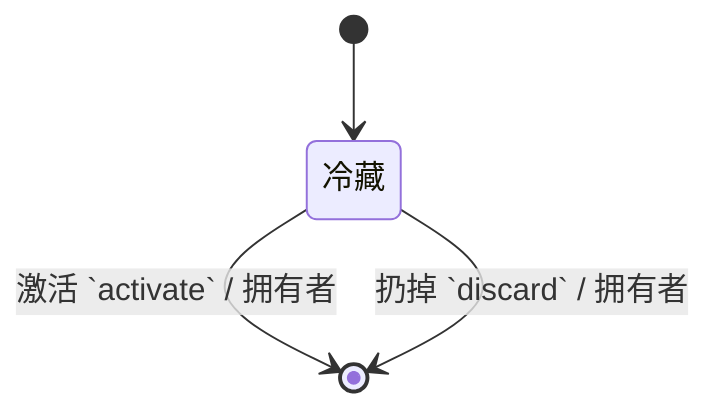

澄清是把收集箱里的东西变成「系统里可信任的条目」的过程。一次只看一条，按固定问题往下走——问题顺序比聪明判断更重要，否则人会跳来跳去又堆回去。

{#202608022121}
## 谁在用

| 角色 | 典型一刻 |
| --- | --- |
| 自己 | 每天抽 10–20 分钟，从箱顶往下清 |
| 自己 | 每周回顾前，先把箱清到空（或承认暂时清不完） |

澄清是单人动作。同事看不到你的澄清过程。

{#202608022122}
## 场景：一条条目怎么走

对箱里当前这一条，人按下面顺序想（动作也该按这个顺序出现，而不是一排平权选项）：

```text
1. 这是不是一件「需要我行动」的事？
   否 → 扔掉 / 参考资料 / 将来也许
   是 → 继续
2. 能不能两分钟内做完？
   能 → 立刻做完，条目消失（或标完成）
   不能 → 继续
3. 是不是该别人做？
   是 → 变成「等待」，记下等谁
   否 → 继续
4. 有没有一个必须开始的日子或截止日？
   有 → 进「日程」或标日期后再组织
   无 → 继续
5. 要不要多个步骤才算完？
   要 → 升成「项目」，并写出下一步
   不要 → 就是一条「下一步行动」，挂情境
```

成功的标准：**箱变空，或留下的每一条都已经有明确去处**——不是「我看过了还堆着」。

## 场景：两分钟规则

「两分钟」是人的启发式，不是系统计时器。系统不必真的开秒表；只要在澄清流里把「立刻做完」放成显眼动作，并在做完后从箱里拿走。

## 场景：委派变等待

人写「等小王回报价」。澄清结束时，箱里那条应离开，变成一条挂在「等待」清单上的记录，上面能看出等谁、因何事。之后靠回顾扫等待清单，而不是靠记忆。

{#202608022123}
## 和别处的边界

| 动作 | 不在澄清里做 |
| --- | --- |
| 给项目写完整计划 | 澄清只要求「有下一步」；细节进项目页 |
| 排一周日历 | 日程只收「某天必须碰」的；日程表本身不是本产品重点 |
| 和同事实时商量 | 委派结果记下来即可；聊天在外面发生 |

{#202608022125}
## 澄清出路（收集箱条目上的动作）

这些动作都挂在「收集箱条目」上：成功后**删掉该行**，并按出路写入别的实体（扔掉则只删不写）。发起者一律为拥有者。



| 动作 | 额外写入 |
| --- | --- |
| 扔掉 | 无 |
| 立刻做完 | 无（两分钟内已做完，不留行动） |
| 存为参考 | 一条 [参考资料](../organize/01-projects.md#202608022139) |
| 将来也许 | 一条 [将来也许](#202608022126) |
| 委派等待 | 一条 [等待](../organize/01-projects.md#202608022137)，`等人` 必填 |
| 标日程 | 一条 [下一步](../organize/01-projects.md#202608022136)，`日程日` 必填 |
| 升为项目 | 一条 [项目](../organize/01-projects.md#202608022135) + 一条下一步 |
| 收为下一步 | 一条下一步；`情境` 可空，回顾时再补也行 |

{#202608022126}
## 将来也许 `somedays`

冷藏「现在不做、以后可能做」的念头。激活时升成项目或下一步，并删掉本行。

| 字段 | 类型 | 约束 |
| --- | --- | --- |
| 拥有者 `owner_id` | 引用 用户 | 必填 |
| 标题 `title` | 文本 | 必填，≤200 |
| 备注 `notes` | 长文本 | 可空，≤8000 |

| 可见性 | 规则 |
| --- | --- |
| 拥有者 | 拥有者本人可读写 |
| 默认 | 私有 |


