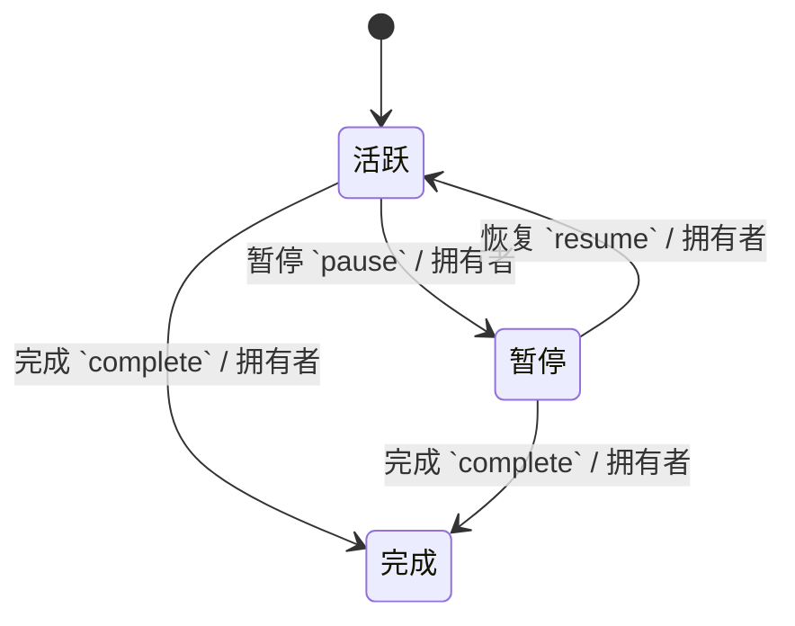
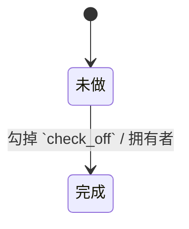
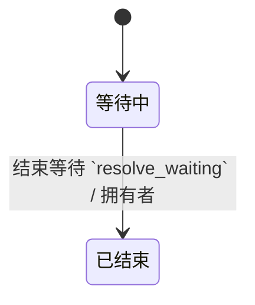
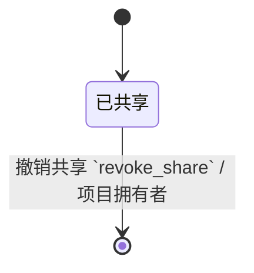

项目是「要不止一步才算完」的结果承诺；下一步是「在某个情境下可以立刻动手」的单一动作。系统可信的前提是：**每个活跃项目都有且只有一条当前下一步**（或明确标成「等待」）。

{#202608022131}
## 谁在用

| 角色 | 典型一刻 |
| --- | --- |
| 自己 | 澄清时把「办护照」升成项目，写下「下载表格」为下一步 |
| 自己 | 做完一步，勾掉，立刻写下新的下一步 |
| 同事（只读） | 被分享了一个项目，只看标题与当前下一步，不改你的清单 |

{#202608022132}
## 场景：活跃项目必须有下一步

打开项目列表时，人应一眼看出哪些项目「卡着」——没有下一步、也不是在等待。卡着的项目等于系统在撒谎：它看起来在管，其实没人知道下一步谁做。

每周回顾会专门扫这类空洞，见 [每周回顾](../review/01-weekly.md#202608022151)。

「当前下一步」**不存显式指针**：从该项目下 `状态 = 未做` 的下一步里按创建时间取最早一条；一条都没有且也没有进行中的等待，列表上标成空洞。

## 场景：做完一步

人勾掉当前下一步之后，焦点应停在「下一条写什么」，而不是跳回大列表。没有下一条就等于项目再次变空——要嘛补一步，要嘛把项目标完成或暂停。

## 场景：项目完成与暂停

- **完成**：结果已达成，项目从活跃列表消失，进已完成（可查）。
- **暂停**：暂时不推，但不算完（例如「等预算季再启动」）。暂停的项目回顾时仍要扫一眼，避免遗忘。

## 场景：只读共享

偶尔需要让同事看到「官网改版」做到哪了。分享的是**一个项目的只读视图**，不是整本 GTD。对方看不到你的收集箱、等待清单或别的项目。

{#202608022133}
## 和别处的边界

| 概念 | 归属 |
| --- | --- |
| 一次性动作（「回电给诊所」） | 下一步清单，不升项目 |
| 参考资料（护照政策链接） | 可挂在项目下，但不是行动 |
| 情境（@电脑） | 标在下一步上，见 [情境](02-contexts.md#202608022141) |

{#202608022135}
## 项目 `projects`

| 字段 | 类型 | 约束 |
| --- | --- | --- |
| 拥有者 `owner_id` | 引用 用户 | 必填 |
| 标题 `title` | 文本 | 必填，≤200 |
| 状态 `status` | 枚举 活跃 / 暂停 / 完成 | 默认 活跃 |
| 备注 `notes` | 长文本 | 可空，≤8000 |

| 可见性 | 规则 |
| --- | --- |
| 拥有者 | 拥有者本人可读写 |
| 被分享者 | 经项目共享只读 |
| 默认 | 私有 |

「被分享者」这一行表示：出现在 [项目共享](#202608022138) 里的用户可读本项目及其下一步、参考；不可写。

{#202608022136}
## 下一步 `next_actions`

| 字段 | 类型 | 约束 |
| --- | --- | --- |
| 拥有者 `owner_id` | 引用 用户 | 必填 |
| 标题 `title` | 文本 | 必填，≤200 |
| 项目 `project_id` | 引用 项目 | 可空 |
| 情境 `context_id` | 引用 情境 | 可空 |
| 日程日 `scheduled_on` | 日期 | 可空 |
| 状态 `status` | 枚举 未做 / 完成 | 默认 未做 |

| 可见性 | 规则 |
| --- | --- |
| 拥有者 | 拥有者本人可读写 |
| 被分享者 | 经所属项目的共享只读 |
| 默认 | 私有 |

无项目的下一步只有拥有者可见。勾掉用自定义动作，便于在契约里写「勾完若项目变空要提示补一步」。

{#202608022137}
## 等待 `waiting_fors`

| 字段 | 类型 | 约束 |
| --- | --- | --- |
| 拥有者 `owner_id` | 引用 用户 | 必填 |
| 标题 `title` | 文本 | 必填，≤200 |
| 等人 `waiting_on` | 文本 | 必填，≤120 |
| 项目 `project_id` | 引用 项目 | 可空 |
| 状态 `status` | 枚举 等待中 / 已结束 | 默认 等待中 |

| 可见性 | 规则 |
| --- | --- |
| 拥有者 | 拥有者本人可读写 |
| 默认 | 私有 |

{#202608022138}
## 项目共享 `project_shares`

| 字段 | 类型 | 约束 |
| --- | --- | --- |
| 项目 `project_id` | 引用 项目 | 必填 |
| 观者 `viewer_id` | 引用 用户 | 必填，项目内唯一 |
| 权限 `permission` | 枚举 只读 / 可写 | 默认 只读 |

| 可见性 | 规则 |
| --- | --- |
| 项目拥有者 | 拥有者本人可读写 |
| 观者 | 本人可读写 |
| 默认 | 私有 |

观者「可读写」仅针对共享行本身（例如自己退出共享）；不能改项目内容。界面这一版只提供只读授权；枚举里预留可写，避免以后加权限时改表形。

授权用新建共享行即可；撤销是自定义动作，删行。

{#202608022139}
## 参考资料 `ref_items`

| 字段 | 类型 | 约束 |
| --- | --- | --- |
| 拥有者 `owner_id` | 引用 用户 | 必填 |
| 标题 `title` | 文本 | 必填，≤200 |
| 正文 `body` | 长文本 | 可空，≤8000 |
| 链接 `url` | 文本 | 可空，≤2000 |
| 项目 `project_id` | 引用 项目 | 可空 |

| 可见性 | 规则 |
| --- | --- |
| 拥有者 | 拥有者本人可读写 |
| 被分享者 | 经所属项目的共享只读 |
| 默认 | 私有 |
