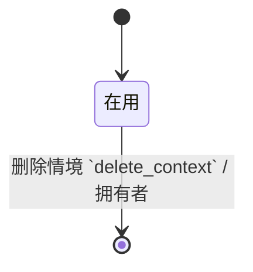

情境回答的是「我现在人在哪、手上有什么工具」，不是「这件事有多重要」。执行时人打开一个情境清单，只看此时能做的下一步——减少从总清单里挑来挑去。

## 谁在用 {#202608022141}

| 角色 | 典型一刻 |
| --- | --- |
| 自己 | 坐在电脑前，打开 @电脑，只看需要电脑的下一步 |
| 自己 | 通勤只有手机，打开 @电话 或 @网上 |
| 自己 | 在家，打开 @家事 |

## 场景：按情境执行 {#202608022142}

人不会「做完所有事」；人会「在当前约束下做一件」。情境清单的成功标准是：**打开后 10 秒内能挑出一件动手**，而不是面对上百条按优先级排序的总表。

这一版不做智能排序。清单默认按人上次排的顺序或创建时间即可；重要的是过滤对。

## 场景：预置与自定义

系统带一组常见情境（例如 @电脑、@电话、@外出、@家事）。人可以增删自己的情境。删掉一个情境时，还挂在它上面的下一步不能悄悄丢——要么要求改挂，要么拒绝删除。

## 场景：一条下一步多个情境？

第一版**一条下一步一个主情境**（字段可空）。多情境会让「我现在该看哪张清单」变糊。

## 和别处的边界 {#202608022143}

| 不是情境 | 是什么 |
| --- | --- |
| 高优先级 / 紧急 | 能量或时限另议；本版不做优先级矩阵 |
| 某项目名 | 项目是结果容器；情境是执行过滤 |
| 「等待小王」 | 那是等待清单，不是 @小王 情境 |

## 情境 `contexts` {#202608022145}

| 字段 | 类型 | 约束 |
| --- | --- | --- |
| 拥有者 `owner_id` | 引用 用户 | 必填 |
| 名称 `name` | 文本 | 必填，≤64，拥有者内唯一 |
| 预置 `is_builtin` | 布尔 | 默认 false |

| 可见性 | 规则 |
| --- | --- |
| 拥有者 | 拥有者本人可读写 |
| 默认 | 私有 |

预置情境在账号创建时写入（@电脑、@电话、@外出、@家事）；`预置 = true` 的不可删，可改名。自建情境删除前必须没有未做的下一步仍引用它，否则拒绝。

