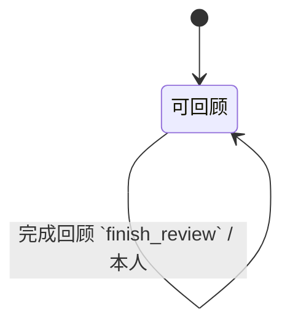

回顾是让系统重新变得可信的仪式。不做回顾，清单会慢慢变成「以前想过的事」的坟场——人不再相信它，又退回用脑子记。

{#202608022151}
## 谁在用

| 角色 | 典型一刻 |
| --- | --- |
| 自己 | 周五下午或周日晚上，按固定清单扫一遍 |
| 自己 | 旅行回来后做一次「补做的回顾」 |

回顾是单人动作。系统可以提供检查清单，但不替人做判断。

{#202608022152}
## 场景：一次回顾要扫什么

建议顺序（回顾时按清单勾即可）：

1. **清空收集箱**——能澄清的澄清；实在没空就诚实留下，但要看见数量  
2. **扫日历**（外部日历即可）——漏进系统的约会、准备动作  
3. **扫等待**——该催的催，已完成的勾掉  
4. **扫项目**——每个活跃项目是否还有下一步；空洞的补上或暂停  
5. **扫「将来也许」**——有没有该激活成项目或扔掉的  
6. **想接下来一两周的结果**——需要新项目就建，并写下第一步  

成功的标准：回顾结束时，人愿意说「我的清单代表现实」。不是「所有事都做完了」。

## 场景：回顾本身不做复杂统计

不需要仪表盘、完成率曲线。有用的话给三个数就够：「活跃项目数 / 无下一步的项目数 / 收集箱条数」，用来指路，不当 KPI。

{#202608022153}
## 和别处的边界

| 回顾不做 | 谁做 |
| --- | --- |
| 日常澄清每一条新捕获 | [澄清](../clarify/01-process.md#202608022121) |
| 执行某一条下一步 | 情境清单 |
| 团队站会同步 | 本版无；项目只读共享够用就行 |

{#202608022155}
## 回顾（无独立表）

回顾清单是**写死在界面上的六步**，不做成可配置实体——改仪式等于改产品，应改书而不是改行数据。

三个计数全部推导，不落新表：

| 计数 | 算法 |
| --- | --- |
| 收集箱条数 | 当前用户的收集箱条目行数 |
| 活跃项目数 | `状态 = 活跃` 的项目数 |
| 无下一步的项目数 | 活跃项目里，不存在 `状态 = 未做` 的下一步、且不存在 `状态 = 等待中` 的等待 |

完成一次回顾时，把 [用户](../identity/01-account.md#202608022181).`上次回顾` 写成当前时间。动作：

不提醒、不催促；`上次回顾` 只供人自己看「距上次过了多久」。
