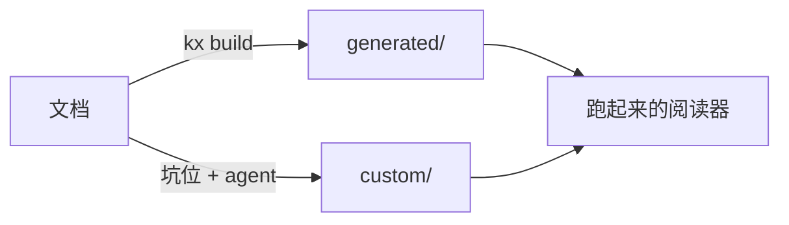

阅读器现在只有一个人用，书就摊在本机磁盘上，谁打开都是同一份。要让几个人一起读同一份文档、各自留各自的标注，就得有账号、有归属、有共享。这本书写的就是这件事。

它同时是**编译器的第一个真实输入**。规范怎么写见 [规范记法](../sample/13-spec-notation.md#202608020101)，界面约束见 [界面基线](../sample/14-ui-baseline.md#202608020201)。

## 为什么拿自己开刀 {#202608020301}

编译器要能把文档变成能跑的东西，这个主张必须先在一个真实系统上兑现，否则只是一份漂亮的设计。挑自己有三个好处：需求我最清楚、跑不通我立刻知道、做出来当天就在用。

拿别人的项目练手，跑通了也不知道是编译器的功劳还是我手补的；拿自己练手，代码就在同一个仓库里，手补了多少一眼看得见。

## 边界 {#202608020302}

这一版只解决「几个熟人一起读」，不解决「对外开放注册」。

| 做 | 不做 |
| --- | --- |
| 用户名 + 密码注册 | 邮箱验证、找回密码、第三方登录 |
| 项目归属到人 | 组织、部门、多租户 |
| 组 + 邀请码 + 组授权 | 细到章节的权限 |
| 标注按人分开 | 标注的实时协同 |
| agent 凭据按人存 | 给 agent 做沙箱 |

右列不是永远不做，是这一版不做。凡是这一版不做的，都不要在规范表里留半截字段。

## 铁律 {#202608020303}

| 铁律 | 说明 |
| --- | --- |
| 规范只有一处 | 表和状态机是唯一权威，代码与文档不一致时改文档重编译 |
| 生成物不手改 | `generated/` 每次重编译整体覆盖，改了会被 `kx verify` 拦下 |
| 结构变更要人点头 | 建表、改列、删列先出变更确认单，人确认后才动库 |
| 标注 id 不动 | 章节与小节 id 一变，读者的标注全部失联 |
