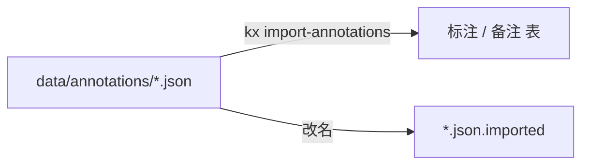

标注现在存在 `data/annotations/<书标识>.json` 里，一本书一个文件，没有作者维度。多人同读时这份文件会互相覆盖，所以它要搬进库。

搬的是标注，不是正文。正文继续留在 Git 里——标注是每个人自己的判断，天天在变，不该污染内容仓的提交历史。

## 标注 `annotations` {#202608020341}

`定位` 就是现在的标注键 `章节id#小节id`，原样搬过来，导入时不必换算。

| 字段 | 类型 | 约束 |
| --- | --- | --- |
| 项目 `project_id` | 引用 项目 | 必填 |
| 作者 `author_id` | 引用 用户 | 必填 |
| 定位 `locator` | 文本 | 必填，≤128，项目+作者内唯一 |
| 标记 `status` | 枚举 未读 `unread` / 已读 `read` / 疑问 `question` / 确认 `confirmed` | 默认 未读 |

| 可见性 | 规则 |
| --- | --- |
| 作者 | 拥有者本人可读写 |
| 默认 | 私有 |

标注只有作者自己能看。共读一份文档时，别人的判断会干扰自己的判断——想让别人看见，那是评论，不是标注，这一版不做。

## 备注 `notes` {#202608020342}

| 字段 | 类型 | 约束 |
| --- | --- | --- |
| 标注 `annotation_id` | 引用 标注 | 必填 |
| 正文 `text` | 长文本 | 必填 |

| 可见性 | 规则 |
| --- | --- |
| 作者 | 组成员按组授权可见 |
| 默认 | 私有 |

## 从文件搬进库 {#202608020343}

导入是一次性的，跑完就不再跑：读 `data/annotations/*.json`，按书标识找到项目，把每条记录挂到指定用户名下。

原文件不删，改名成 `.imported`。搬家出错时还能回去看原样，这比相信一次成功要稳。

