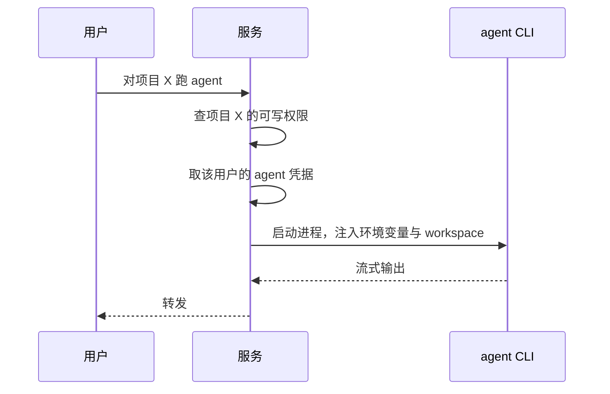

agent 是本机 CLI，登录状态存在跑服务那个操作系统账号的家目录里。多用户之后这就出问题了：所有人共用同一份登录态，谁触发 agent 都花同一个人的额度。

所以凭据要按人存。存的是环境变量，不是账号密码——CLI 自己认哪个变量，我们只负责在启动它时把变量塞进去。

{#202608020351}
## Agent 凭据 `agent_credentials`

| 字段 | 类型 | 约束 |
| --- | --- | --- |
| 拥有者 `owner_id` | 引用 用户 | 必填 |
| Agent 标识 `agent_key` | 文本 | 必填，≤32，拥有者内唯一 |
| 密钥 `secret` | 文本 | 必填，隐藏 |

| 可见性 | 规则 |
| --- | --- |
| 拥有者 | 拥有者本人可读写 |
| 默认 | 私有 |

`Agent 标识` 对应 `config/agents.json` 里的 `id`（如 `cursor`、`claude-code`）。密钥落库前用主密钥加密，主密钥从服务进程的环境变量读，不进库也不进仓库。

{#202608020352}
## 两种登录方式

| 方式 | 怎么用 | 什么时候选它 |
| --- | --- | --- |
| CLI 自带登录 | 在跑服务的机器上 `agent login`，不填密钥 | 就自己一个人用 |
| 密钥 | 在设置页填一次，服务启动 CLI 时注入环境变量 | 多人共用一台机器 |

配置里给每个 agent 加一段 `auth`，声明它要哪个环境变量、以及怎么探测已登录：

```json
{
  "id": "cursor",
  "auth": {
    "envVar": "CURSOR_API_KEY",
    "probe": ["agent", "status"]
  }
}
```

{#202608020353}
## 谁能对哪本书动手

agent 启动时 `--workspace` 指向某本书的目录，所以触发前必须先核一遍：这个人对这个项目有没有可写权限。核不过就不启动进程。

这是唯一一处「越权直接等于改别人文件」的地方，判断要放在启动进程之前，不能靠 CLI 自己拦。



:::details 没配凭据时的表现
接口返回该 agent 的 `authOk: false`，界面把它标成「未登录」并给出配置入口，而不是让人点了才发现跑不起来。
:::
