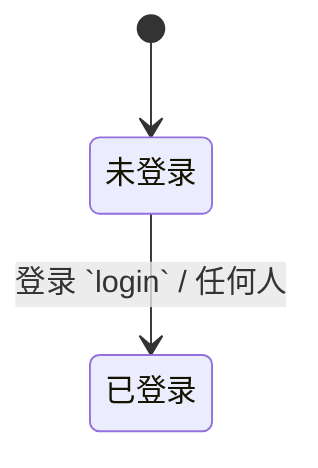
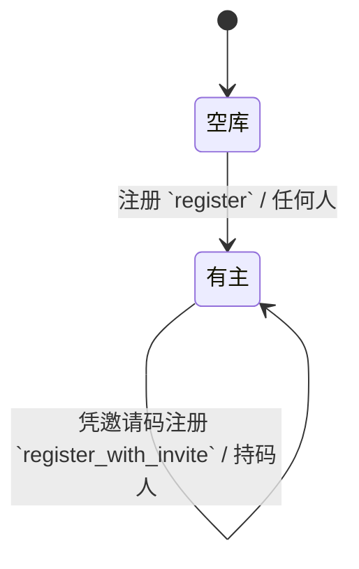

本机部署没有邮件通道，也没有短信通道，所以身份就落在用户名加密码上。密码用 scrypt 派生后存哈希，会话用随机令牌，令牌本身也只存哈希——数据库泄露不等于能冒充人登录。

{#202608020311}
## 用户 `users`

用户名当登录名，另留一个显示名，是为了让人改称呼时不必改登录名。

| 字段 | 类型 | 约束 |
| --- | --- | --- |
| 用户名 `username` | 文本 | 必填，≤32，唯一 |
| 显示名 `display_name` | 文本 | 必填，≤64 |
| 密码哈希 `password_hash` | 文本 | 必填，隐藏 |

| 可见性 | 规则 |
| --- | --- |
| 本人 | 本人可读写 |
| 同组 | 组成员按组授权可见 |
| 默认 | 私有 |

同组可见的只有用户名与显示名，密码哈希标了隐藏，任何接口都不返回它。

{#202608020312}
## 会话 `sessions`

会话独立成表而不是签一个自包含的令牌，是为了能立刻踢掉一个会话——删行即失效。代价是每个请求多一次查库，本机部署这点开销无所谓。

| 字段 | 类型 | 约束 |
| --- | --- | --- |
| 令牌哈希 `token_hash` | 文本 | 必填，唯一，隐藏 |
| 用户 `user_id` | 引用 用户 | 必填 |
| 过期时间 `expires_at` | 时间 | 必填 |

| 可见性 | 规则 |
| --- | --- |
| 本人 | 拥有者本人可读写 |
| 默认 | 私有 |

反向那条没写：会话是被删掉而不是被推到某个终态，删行即失效，没有「已登出」这个状态可谈。

:::details 令牌怎么走
明文令牌只在登录响应里出现一次，之后写进 HttpOnly Cookie。服务端拿到 Cookie 后算一次哈希去查表，查不到或过期就当没登录。
:::

{#202608020313}
## 首个用户

库里一个用户都没有的时候，注册接口放开；有了第一个用户之后，注册接口关掉，之后只能靠组邀请码进来。<!-- kx-lint-ignore: prose-rule 这句是下面状态机的白话版 -->

这样不必写一套邀请审批，也不会让本机服务暴露成任何人可注册。

