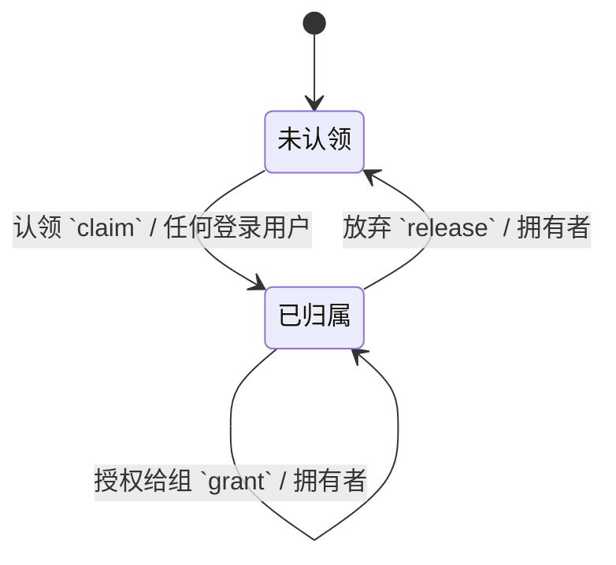

一个项目就是磁盘上的一本书，加一条归属记录。书的正文继续留在文件系统与各自的 Git 仓库里，库里只存「这本书是谁的、谁能看」。

这样分是因为两种数据的性质不同：正文要能 diff、能合并、能用编辑器直接改；归属关系要能连表查、能加索引。硬把正文塞进库里，Git 那套能力就全丢了。

{#202608020321}
## 项目 `projects`

`书标识` 就是 `books/` 下的目录名，两边靠它对上。

| 字段 | 类型 | 约束 |
| --- | --- | --- |
| 书标识 `book_id` | 文本 | 必填，≤64，唯一，只读 |
| 标题 `title` | 文本 | 必填，≤120 |
| 拥有者 `owner_id` | 引用 用户 | 必填 |

| 可见性 | 规则 |
| --- | --- |
| 拥有者 | 拥有者本人可读写 |
| 授权组 | 组成员按组授权可见 |
| 默认 | 私有 |

{#202608020322}
## 磁盘上已有的书

磁盘上先有书、库里后有项目，所以要有一条认领路径：第一个用户登录后，`books/` 下每个没有归属记录的目录都列出来，认领一个就写一条项目行。

没被认领的书不出现在任何人的列表里。这比默认全给第一个用户安全——多人机器上，谁放进去的书归谁。

