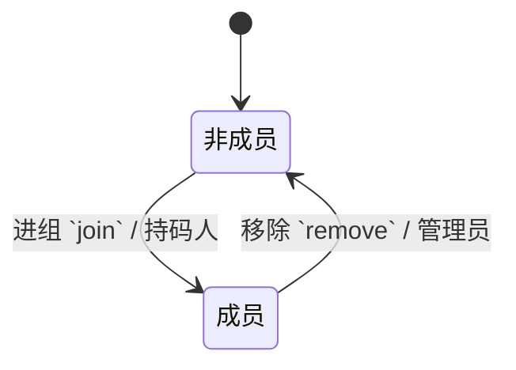
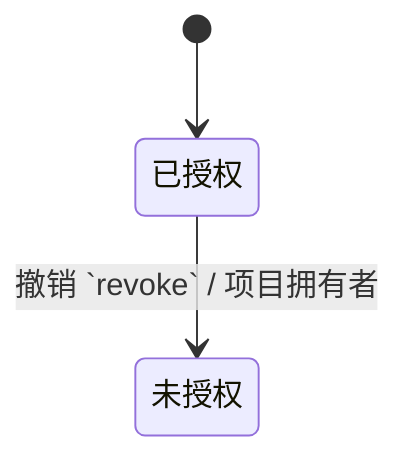
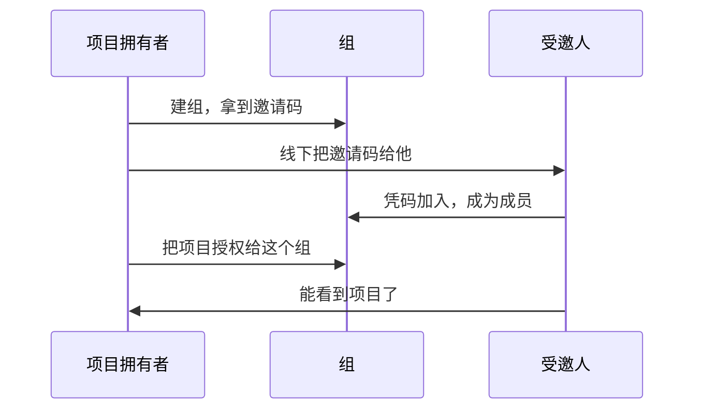

共享挂在组上而不是直接挂在人上，是因为同一批人往往要看同一批项目。挂在人上，每加一个项目就要重新点一遍名单；挂在组上，加项目只授权一次。

组的成本是多一层间接，收益是名单只维护一处。三五个人的规模其实两种都能忍，选组是为了后面项目变多时不用改数据模型。

{#202608020331}
## 组 `user_groups`

邀请码是进组的唯一途径，所以它必须能重置——码泄露了就换一个，已进来的人不受影响。

| 字段 | 类型 | 约束 |
| --- | --- | --- |
| 名称 `name` | 文本 | 必填，≤64 |
| 拥有者 `owner_id` | 引用 用户 | 必填 |
| 邀请码 `invite_code` | 文本 | 必填，唯一 |

| 可见性 | 规则 |
| --- | --- |
| 拥有者 | 拥有者本人可读写 |
| 成员 | 组成员按组授权可见 |
| 默认 | 私有 |

{#202608020332}
## 组成员 `group_members`

| 字段 | 类型 | 约束 |
| --- | --- | --- |
| 组 `group_id` | 引用 组 | 必填 |
| 成员 `member_id` | 引用 用户 | 必填，组内唯一 |
| 角色 `role` | 枚举 管理员 / 成员 | 默认 成员 |

| 可见性 | 规则 |
| --- | --- |
| 管理员 | 组内管理员可读写 |
| 同组 | 组成员按组授权可见 |
| 默认 | 私有 |

组拥有者恒为管理员，也就没有把自己移出去的那条路——名单空了的组没人能再管它。

{#202608020333}
## 项目授权 `project_grants`

| 字段 | 类型 | 约束 |
| --- | --- | --- |
| 项目 `project_id` | 引用 项目 | 必填 |
| 组 `group_id` | 引用 组 | 必填，项目内唯一 |
| 权限 `permission` | 枚举 只读 / 可写 | 默认 只读 |

| 可见性 | 规则 |
| --- | --- |
| 项目拥有者 | 拥有者本人可读写 |
| 被授权组 | 组成员按组授权可见 |
| 默认 | 私有 |

授权一建出来就是生效的，所以没有「待生效」这种中间态。撤销把整行删掉而不是留个失效标记——留着的话，下次再授权同一个组就要先想清楚是复活旧行还是建新行。

`只读` 能读正文和自己的标注；`可写` 还能改正文、触发 agent、提交该书的 Git 仓库。

:::details 可见性怎么落到查询上
每个实体的可见性表编译成一段 where 片段，由数据访问层统一拼进去，业务代码碰不到它。漏加过滤是这类系统最常见的越权来源，把它做成不可绕过的一层，比靠人记得加要可靠。
:::

{#202608020334}
## 一次共享要走几步

