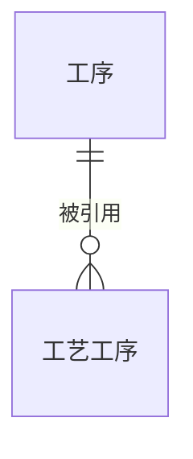

{#20260810150802}
:::details mo_workstage
| Field | Comment | Type | Null | Key | Default | Extra |
| --- | --- | --- | --- | --- | --- | --- |
| id | | int | NO | PRI | | auto_increment |
| stage_code | 工序代码 | varchar(50) | YES | UNI | NULL | |
| stage_name | 工序名称 | varchar(64) | NO | | | |
| stage_desc | 工序说明 | varchar(256) | YES | | NULL | |
| step_type_no | 过站编号 | varchar(10) | YES | | NULL | |
| target_table | 目标表 | varchar(100) | YES | | NULL | |
:::

{#202608101214}
:::details E-R

:::

{#20260810142702}
:::details mo_process_flow
| Field | Comment | Type | Null | Key | Default | Extra |
| --- | --- | --- | --- | --- | --- | --- |
| id | | int | NO | PRI | | auto_increment |
| process_code | 工艺编号 | varchar(32) | YES | MUL | NULL | |
| process_name | 工艺名称 | varchar(64) | YES | | NULL | |
| process_desc | 说明 | varchar(256) | YES | | NULL | |
| stage_code | 工序代码 | varchar(32) | NO | MUL | | |
| allow_floating_sn | 允许游离 SN | tinyint(1) | YES | | 0 | |
| is_optional | 选做 | tinyint(1) | YES | | 0 | |
| has_pass_record | 有过站记录 | tinyint(1) | YES | | 0 | |
| step_graph | 前序 DAG | json | YES | | NULL | |
:::
