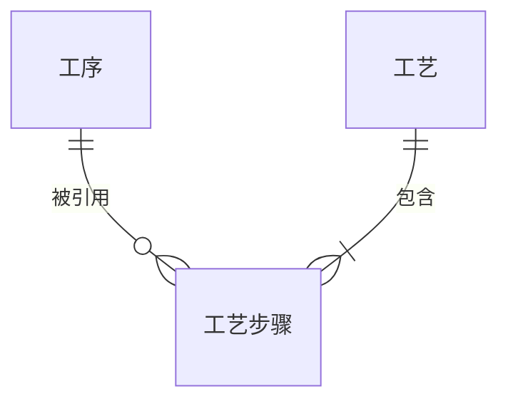

{#20260810150802}
:::details operations
| Field | Comment | Type | Null | Key | Default | Extra |
| --- | --- | --- | --- | --- | --- | --- |
| op_code | 工序代码 | varchar(32) | NO | PRI | NULL | |
| op_name | 工序名称 | varchar(64) | NO | | NULL | |
| station_no | 过站编号 | varchar(16) | YES | | NULL | |
| remark | 说明 | varchar(255) | NO | | NULL | |
:::

{#202608101214}
:::details E-R

:::

{#20260810142702}
:::details process_flows
| Field | Comment | Type | Null | Key | Default | Extra |
| --- | --- | --- | --- | --- | --- | --- |
| flow_code | 工艺编号 | varchar(32) | NO | PRI | NULL | |
| flow_name | 工艺名称 | varchar(64) | NO | | NULL | |
| remark | 说明 | varchar(255) | NO | | NULL | |
:::

:::details process_flow_steps
| Field | Comment | Type | Null | Key | Default | Extra |
| --- | --- | --- | --- | --- | --- | --- |
| flow_code | 工艺编号 | varchar(32) | NO | PRI | NULL | |
| op_code | 工序代码 | varchar(32) | NO | PRI | NULL | |
| seq | 顺序 | int | NO | | NULL | |
| predecessors | 前序工序 | varchar(512) | YES | | NULL | |
| allow_orphan_sn | 允许游离 SN | tinyint(1) | NO | | 0 | |
| optional | 选做 | tinyint(1) | NO | | 0 | |
| has_pass_record | 有过站记录 | tinyint(1) | NO | | 0 | |
:::
