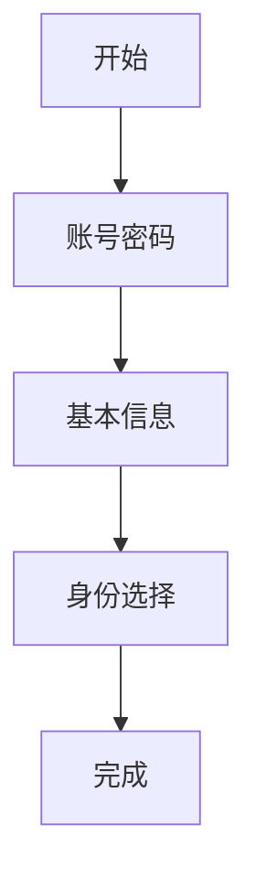
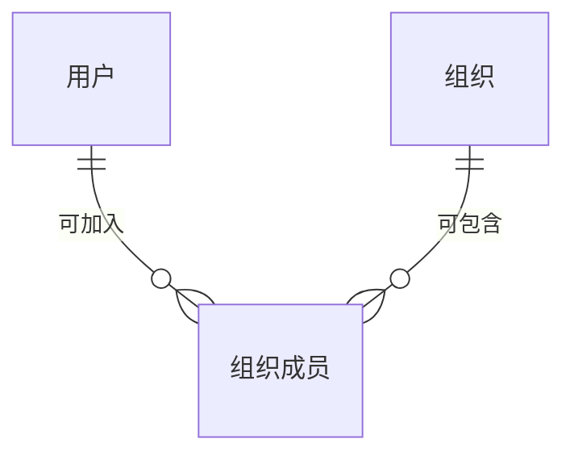

账号从注册开始：人填完身份相关信息后，系统才认得出「这是谁、属于哪一类身份」。本章只写注册这一条路径；登录、找回密码另开章。

写法：同一步用共用 `###` 标题聚拢；流程 / 界面 / 兜底分小节；实体按表整表写在步骤之后；透镜只过滤显示。

{#202608051438}
## 用户发起账号注册

{#202608051432}


{#202608051460}
### 账号密码

{#202608051440}
| 人填写 | 系统动作 |
| --- | --- |
| 邮箱、密码 | 校验格式与邮箱未被占用 |

{#202608051451}
:::details UI
```wireframe
@frame 注册 · 账号密码
邮箱
密码
@btn 下一步
已有账号？去登录
```
:::

{#202608051452}
| 情况 | 表现 | 人接下来能做什么 |
| --- | --- | --- |
| 邮箱格式非法 / 已被占用 | 字段下红字；占用时提示「该邮箱已注册」 | 改邮箱，或去登录 |
| 密码过短或不符规则 | 字段下说明规则（长度、字符） | 改密码后继续 |

{#202608051461}
### 基本信息

{#202608051441}
| 人填写 | 系统动作 |
| --- | --- |
| 手机号、用户名 | 校验格式与用户名唯一 |

{#202608051454}
:::details UI
```wireframe
@frame 注册 · 基本信息
手机号
用户名
@btn 上一步 · 下一步
```
:::

{#202608051455}
| 情况 | 表现 | 人接下来能做什么 |
| --- | --- | --- |
| 手机号格式非法 / 已被占用 | 字段下红字 | 改手机号 |
| 用户名格式非法 / 已被占用 | 字段下红字 | 改用户名 |

{#202608051462}
### 身份选择

{#202608051442}
| 选项 | 人填写 | 系统动作 |
| --- | --- | --- |
| 个人 | 无 | 写用户，身份 = 个人 |
| 加入组织 | 组织 ID | 校验组织存在，写用户 + 成员关系 |
| 创建组织 | 组织名称 | 写用户 + 组织 + 拥有者成员关系 |

{#202608051457}
:::details UI
```wireframe
@frame 注册 · 身份选择
○ 个人
○ 加入组织
○ 创建组织
组织 ID（选加入时）
组织名称（选创建时）
@btn 上一步 · 完成注册
```
:::

{#202608051458}
| 情况 | 表现 | 人接下来能做什么 |
| --- | --- | --- |
| 组织 ID 不存在 | 字段下「找不到该组织」 | 核对 ID，或改选创建组织 / 个人 |
| 组织名称已被占用 | 字段下「名称已被使用」 | 换名称 |
| 未选身份就点完成 | 提示必选一项 | 选出身份类型 |

{#202608051463}
### 实体

{#202608051433}
:::details E-R

:::

{#202608051450}
:::details users
| 字段 | 标识 | 类型 | 约束 |
| --- | --- | --- | --- |
| 邮箱 | email | 文本 | 必填，≤254 |
| 密码哈希 | password_hash | 文本 | 必填，隐藏 |
| 手机号 | phone | 文本 | 必填，≤20 |
| 用户名 | username | 文本 | 必填，≤32 |
| 身份类型 | identity_type | 枚举 | 必填：personal / org_member |

| 索引 | 字段 | 说明 |
| --- | --- | --- |
| 唯一 | email | |
| 唯一 | phone | |
| 唯一 | username | |
:::

{#202608051453}
:::details organizations
| 字段 | 标识 | 类型 | 约束 |
| --- | --- | --- | --- |
| 组织 ID | org_id | 文本 | 必填，≤32，创建时生成 |
| 名称 | name | 文本 | 必填，≤64 |

| 索引 | 字段 | 说明 |
| --- | --- | --- |
| 主键 | org_id | |
| 唯一 | name | |
:::

{#202608051456}
:::details org_members
| 字段 | 标识 | 类型 | 约束 |
| --- | --- | --- | --- |
| 用户 | user_id | 引用 用户 | 必填 |
| 组织 | org_id | 引用 组织 | 必填 |
| 角色 | role | 枚举 | 必填：owner / member |

| 索引 | 字段 | 说明 |
| --- | --- | --- |
| 唯一 | user_id, org_id | 同一用户在同一组织只允许一行 |
:::

{#202608051437}
### 全程兜底

跨步骤、不绑在单步上的失败与约定。

| 情况 | 表现 | 人接下来能做什么 |
| --- | --- | --- |
| 网络失败 / 服务超时 | 页内错误条，保留已填内容 | 重试提交，不必重填整表 |
| 中途关闭页 | 已填内容不自动落库 | 下次从头注册；不建半成品用户 |

提交成功前**不写用户行**。校验失败停在当前步，已通过的前序步骤内容保留在表单里。占用检查以提交时服务端结果为准，前端预检只是提前拦截明显错误。
