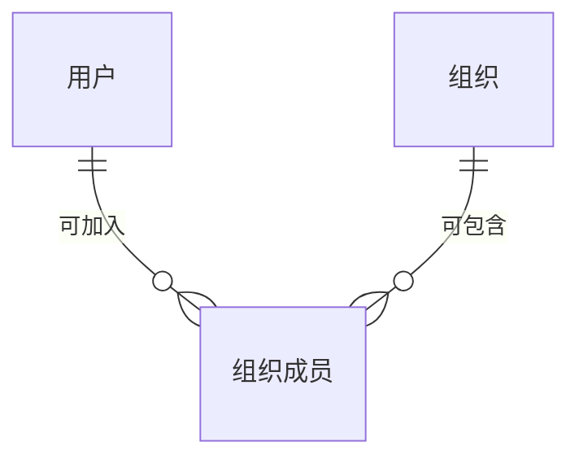

{#202608051433}
:::details E-R

:::

{#202608051480}
:::details users
| 字段 | 标识 | 类型 | 约束 | {#202608051481}
| --- | --- | --- | --- | --- |
| 邮箱 | email | 文本 | 必填，≤254 |{#202608051470}
| 密码哈希 | password_hash | 文本 | 必填，隐藏 | |
| 手机号 | phone | 文本 | 必填，≤20 |{#202608051473}
| 用户名 | username | 文本 | 必填，≤32 | |
| 身份类型 | identity_type | 枚举 | 必填：personal / org_member |{#202608051450}

| 索引 | 字段 | 说明 | {#202608051486}
| --- | --- | --- | --- |
| 唯一 | email | |{#202608051484}
| 唯一 | phone | |{#202608051485}
| 唯一 | username | |{#202608051487}
:::

{#202608051453}
:::details organizations
| 字段 | 标识 | 类型 | 约束 |
| --- | --- | --- | --- |
| 组织 ID | org_id | 文本 | 必填，≤32，创建时生成 |
| 名称 | name | 文本 | 必填，≤64 |

| 索引 | 字段 | 说明 |
| --- | --- | --- |
| 主键 | org_id | |
| 唯一 | name | |
:::

{#202608051456}
:::details org_members
| 字段 | 标识 | 类型 | 约束 |
| --- | --- | --- | --- |
| 用户 | user_id | 引用 用户 | 必填 |
| 组织 | org_id | 引用 组织 | 必填 |
| 角色 | role | 枚举 | 必填：owner / member |

| 索引 | 字段 | 说明 |
| --- | --- | --- |
| 唯一 | user_id, org_id | 同一用户在同一组织只允许一行 |
:::
