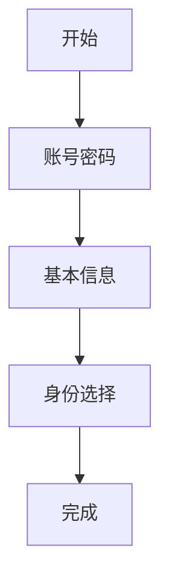

{#202608051432}

{#202608051440}
| 人填写 | 系统动作 |
| --- | --- |
| 邮箱、密码 | 校验格式与邮箱未被占用 |

{#202608051441}
| 人填写 | 系统动作 |
| --- | --- |
| 手机号、用户名 | 校验格式与用户名唯一 |

{#202608051442}
| 选项 | 人填写 | 系统动作 |
| --- | --- | --- |
| 个人 | 无 | 写用户，身份 = 个人 |
| 加入组织 | 组织 ID | 校验组织存在，写用户 + 成员关系 |
| 创建组织 | 组织名称 | 写用户 + 组织 + 拥有者成员关系 |
