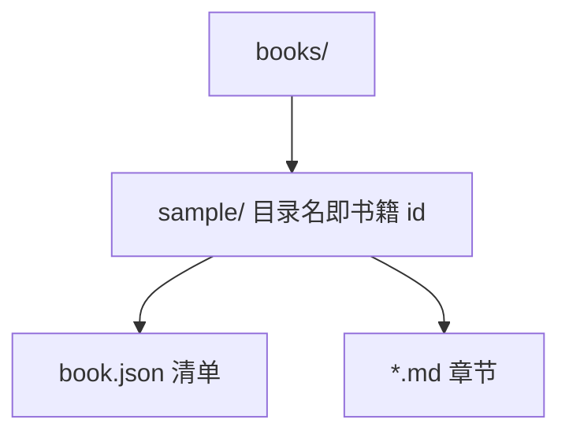
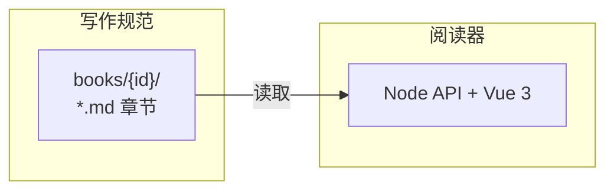

本页是写书的**机械合同**（实现透镜）。生成或修改任何书之前，必须遵守。核心只有一条：**id 必须稳定**。结构思想见场景透镜的 [结构思想](02-structure.md#thesis)。

{#layout}
## 目录结构

```
books/
  <book-id>/            # 目录名即书籍 id：小写字母、数字、连字符
    book.json           # 书籍清单
    .git/               # 推荐：每本书独立 Git 仓库（对比变更依赖它）
    01-overview.md      # 章节文件；可用子目录分组，如 identity/01-auth.md
    identity/
      01-auth.md
    assets/             # 本书照片/插图（相对路径引用）
      overview.png
      screenshots/
        login.jpg
data/
  annotations/<book-id>.json   # 阅读器维护的标注数据，生成器【禁止】读写
```

内容变更后由阅读器在该书仓库内自动 `git add` / `git commit`（见 [自动 commit](09-git-compare.md#auto-commit)）；也可人手提交。标注仍在 reader 的 `data/`，与内容仓分离。



{#manifest}
## 清单文件 book.json

`lenses` 与 `contents` 都是**自带 title 的树数组**（无 `kind`、无 `dimensions`/`axes` 拆分）。

{#manifest-tree}
### 树形

```json
{
  "title": "书名",
  "description": "一句话简介（可选）",
  "lenses": [
    {
      "id": "read",
      "title": "读法",
      "children": [
        { "id": "scenario", "title": "场景" },
        { "id": "impl", "title": "实现" }
      ]
    }
  ],
  "contents": [
    { "id": "overview", "file": "01-overview.md" },
    {
      "id": "identity",
      "title": "身份",
      "children": [
        {
          "id": "auth",
          "file": "identity/01-auth.md",
          "lenses": {
            "read": {
              "scenario": ["login", "register"],
              "impl": ["api", "db"]
            }
          }
        },
        { "id": "me", "file": "identity/me.md", "lenses": { "read": { "scenario": true } } }
      ]
    },
    { "id": "shops", "file": "03-shops.md" }
  ]
}
```

- **`lenses`（可选）**：顶层每一项是一条轴（`id` + `title`）；`children` 为选项树。轴标题写在节点上，代码不写死。见 [阅读透镜](06-lenses.md#how)。
- **`ruler`（可选）**：尺子读法——指定轴 / 钥匙叶子与 `links`（钥匙小节 → 关联小节）。见 [阅读透镜 · 尺子](06-lenses.md#ruler)。
- **`contents`**：有 `file` = 页（`id` 须与 frontmatter 一致；可选 `lenses`、`showLevel`、`role`）；有 `title` + `children` = 目录组。
- **页项 `lenses`**：按轴声明归属，**key 必须是叶子** option id。省略则各轴常显。`true` = 整页；`string[]` = 可见小节 id。
- **页项 / frontmatter `showLevel`**：该页最多显示到哪一档内容 `rank`（页项优先）。见 [稳定 ID](#stable-ids)。
- **页项 / frontmatter `role`**：`ruler` = 模块尺子骨架（步骤键 / rank；挂靠时 TOC 落此页；单选维度时不当正文页）；`page` 或省略 = 普通内容页。页项优先于 frontmatter。
- 翻页（←/→）只在**当前透镜可见的**叶子页之间按 DFS 顺序走动；组节点被跳过。
- 组可再嵌套组；深度不限。TOC 里**同一深度样式相同**（组与叶子页无关）；更深一层再弱一档。
- 删除叶子页：从 `contents` 树移除；该页标注进入「孤立标注」面板。

{#chapter-files}
## 章节文件

每个章节是一个 Markdown 文件，YAML frontmatter **必须**包含 `id` 与 `title`，且与 `book.json` 中该页的 `id` 一致。透镜归属写在 `book.json` 的 contents 页项 `lenses`，**不要**在页上写 `layer` / `pair`：

```markdown
---
id: "202607281805"
title: 结构思想
---
```

- `id` 是章节的稳定标识：全书唯一，**一经使用永不修改**（文件可以改名重排，id 不可变）。
- **新建章节**：`id` 用时间戳、**不带业务含义**（推荐 `YYYYMMDDHHmm`，如 `202607281805`），避免标题一改就想改 id。纯数字时间戳在 YAML 里请加引号（`id: "202607281805"`），否则会被解析成数字。
- **已有章节**：禁止把旧 id 改成时间戳或任何新值——一改，标注全部失联。
- 正文**不要**写 `# 一级标题`，章节标题由 frontmatter 的 `title` 渲染。

:::details 章节 id 与文件名为什么解耦
文件名带 `01-` 这类序号前缀，是给人在文件管理器里看的，重排章节时可能改名。
而章节 id 是标注键的一部分，必须永远不变。时间戳只解决「新建时别起语义名」；稳定性仍靠「永不改已有 id」。
:::

{#stable-ids}
## 稳定 ID

小节边界是**独占一行**的 `{#id}` 或 `{#id rank=N}`；标题行不再挂 id。

```markdown
{#202607291820}
## 数据流

{#202607291821 rank=1}
### 输入校验
```

也可以没有标题（仍可标注、透镜过滤，但不进右侧大纲）：

```markdown
{#202608051438 rank=1}
## 用户发起账号注册

{#202608051431}
场景正文……
```

- **小节** id 与**章节** id 同一套规矩：稳定、不带业务含义、一经使用永不修改。
- **`rank`（可选）**：内容等级，任意页可用。与标题 `level`（h2/h3）无关。页可设 `showLevel`（frontmatter 或 book.json 页项，页项优先）；阅读器顶栏也可选「全部等级 / 等级 N」（顶栏优先；选「全部」则不按 rank 过滤）。有生效上限 `N` 时，`rank > N` 的小节不显示。尺子钥匙若 `rank > N`，该键及其挂靠一并隐藏。
- **新建小节**：`id` 用时间戳（推荐 `YYYYMMDDHHmm`，同分钟多节可再加两位序号），**不要**再用 `claim` / `data-flow` 这类语义名——标题一改就想改 id，和章节踩同一个坑。
- **已有小节**：禁止把旧 id 改成时间戳或任何新值（标注键是 `章节id#小节id`）。
- 铁律：
  1. 已存在的 id 永不修改、永不复用给其他内容；
  2. 重新生成/改写章节时，语义相同的小节必须保留原 id；
  3. 新内容一律使用新 id（新建章节、新建小节都用时间戳）；
  4. 要删除的小节直接删除即可，读者的标注会进入「孤立标注」面板。
- 读者的标记与备注以 `章节id#小节id` 为键持久化。id 一变，标注即失联——这是最严重的生成事故。

{#sections}
## 可标记单元

- 阅读器把「独占行 `{#id}` + 到下一个 `{#id}` 之前的内容」作为一个可标记小节。
- 节的大纲标题取节内**第一个** h2–h6；无标题的节不进右侧大纲，仍可标注与透镜过滤。
- 第一个 `{#id}` 之前如果有正文，会自动成为「引言」小节（内部 id 为 `_intro`），可有可无。
- 折叠块（details）内部的 `{#id}` **不构成**小节。
- 粒度建议：一个小节表达一个完整的、可独立判断的观点或主题，正文 1–6 段为宜。
- **禁止**旧写法 `## 标题 {#id}`——id 只写在独占标记行。

{#details-rules}
## 细节折叠写法

正文默认只呈现结论与主干。实现细节、边界情况、原始数据、长表格等放入 details：

```markdown
:::details 字段完整定义
这里是详细内容，支持任意 Markdown。
:::
```

- 折叠标题（可选）写在 `:::details ` 之后，缺省显示「查看细节」。
- 折叠块内部的 `{#id}` 独占行不切节。块内仅需 HTML 锚点时，可在标题行尾写 `{#id}`（只生成 DOM id，不是小节边界）。
- 嵌套时外层用更多冒号（`::::details` 包 `:::details`）。
- 经验法则：**读者不展开任何折叠块也能做出整体判断**。

活演示见 [细节折叠演示](04-details.md#basics)。

{#links}
## 链接

| 目标 | 写法 |
| --- | --- |
| 跨章节小节 | `[稳定 ID](03-format.md#stable-ids)` 或 `[登录](identity/01-auth.md#session-model)`（相对书籍根目录） |
| 同章节小节 | `[见上文](#data-flow)` |
| 外部网页 | 完整 URL，阅读器会新窗口打开 |

- 内部链接的文件名、`#id` 必须真实存在。
- 阅读器会把内部链接转成应用内跳转（不刷新、可定位并高亮）。

试一试：[细节折叠的基本用法](04-details.md#basics)、[本章内跳转到稳定 ID](#stable-ids)。

{#photos}
## 照片与插图

真实照片、产品截图等二进制图放在本书 `assets/` 下，用标准 Markdown 图片语法引用（路径相对书籍根目录）：

```markdown

```

- 允许扩展名：`jpg` / `jpeg` / `png` / `webp` / `gif`；可用子目录。
- `alt` 文案同时作为图下说明；读者点击图片可放大预览。
- 一组照片：同一小节里连续写多张 `` 即可，不必另造相册实体。
- 图片随书走（进该书 `.git`）；阅读器只开放 `assets/`，不会把整本目录挂成静态站。
- **分工**：真实照片/截图用 `assets/`；架构关系与数据流用 Mermaid；界面屏示意用 wireframe。不要用照片冒充结构图，也不要用 Mermaid 画真实 UI。


{#diagrams}
## 图表与 UI 线框

{#mermaid}
### Mermaid

架构关系、数据流、目录结构、时序等**一律用 Mermaid**，禁止 ASCII 方框图。

````markdown

````

- 常用类型：`flowchart`、`sequenceDiagram`、`stateDiagram-v2`。
- 节点文案用引号；换行写 `<br/>`；占位符写 `{id}`，不要写 `<id>`。
- 节点 ≤ 8 个为宜；更复杂的放进 `:::details`。
- 纯代码、配置、日志用普通代码块，不要硬塞进 Mermaid。

{#wireframe}
### Wireframe

界面章的屏示意用 <code>```wireframe</code>，**不要用 Mermaid 冒充线框**。默认放在 `:::details UI` 里，正文只留结构表。整壳只在布局/壳章画；部件页只画部件本身（见 [本义自述](02-structure.md#affirmative)）。

````markdown
:::details UI
```wireframe
@frame 「我」
@card 个人信息 | 编辑
姓名 · 邮箱 · 手机
@footer
@btn 退出登录 · 切换账号
```
:::
````

| 指令 | 含义 |
| --- | --- |
| `@frame 标题` | 外框标题 |
| `@bar 文案` | 顶栏（右侧自动画头像点） |
| `@menu` | 其后若干行 = 下拉菜单项 |
| `@card 标题 \| 操作` | 卡片；`\|` 后为右上角操作 |
| `@badge 文案` | 徽标 |
| `@btn a · b` | 按钮行（`·` 分隔） |
| `@footer` | 页底操作区 |
| 普通行 | 卡片/菜单内一行文案 |

{#markdown-misc}
## 其它 Markdown 约定

- 代码块必须标注语言：`ts` / `json` / `bash` / `mermaid` 等。
- 支持表格、引用、有序/无序列表。
- 一般用 Markdown 表；需要 **合并单元格**（如 `rowspan`）时可用 HTML `<table>`（书内容本地可信）。其它排版仍优先 Markdown，不要用 HTML 绕开合同。
