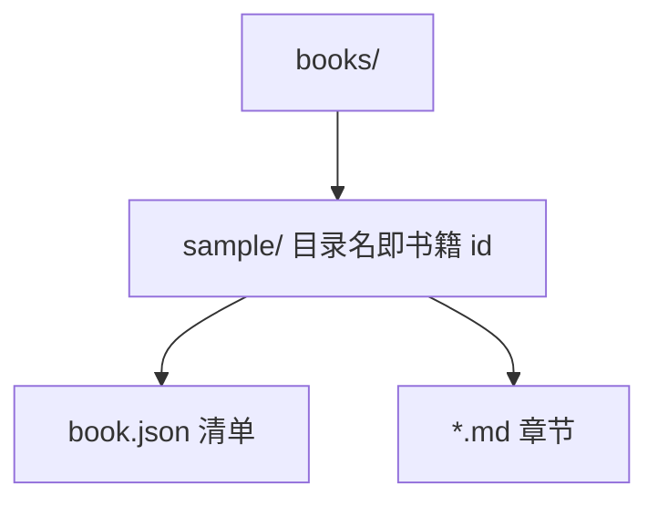
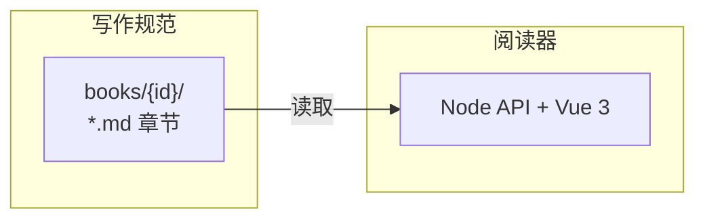

本页是写书的**机械合同**（实现透镜）。生成或修改任何书之前，必须遵守。核心只有一条：**id 必须稳定**。结构思想见场景透镜的 [结构思想](02-structure.md#thesis)。

## 目录结构 {#layout}

```
books/
  <book-id>/            # 目录名即书籍 id：小写字母、数字、连字符
    book.json           # 书籍清单
    .git/               # 推荐：每本书独立 Git 仓库（对比变更依赖它）
    01-overview.md      # 章节文件；可用子目录分组，如 identity/01-auth.md
    identity/
      01-auth.md
data/
  annotations/<book-id>.json   # 阅读器维护的标注数据，生成器【禁止】读写
```

内容变更后应在**该书仓库**内 `git add` + `git commit`；阅读器只读历史做按小节 id 的对比，不会自动 commit。标注仍在 reader 的 `data/`，与内容仓分离。



## 清单文件 book.json {#manifest}

支持两种清单（二选一；同时存在时以 `contents` 为准）。

### 扁平（兼容） {#manifest-flat}

```json
{
  "title": "书名",
  "description": "一句话简介（可选）",
  "chapters": ["01-overview.md", "02-format.md"]
}
```

`chapters` 数组顺序 = 翻页顺序。

### 树形（推荐） {#manifest-tree}

```json
{
  "title": "书名",
  "description": "一句话简介（可选）",
  "lenses": [
    { "id": "scenario", "title": "场景" },
    { "id": "impl", "title": "实现" }
  ],
  "contents": [
    { "type": "page", "file": "01-overview.md" },
    {
      "type": "group",
      "id": "identity",
      "title": "身份",
      "children": [
        { "type": "page", "file": "identity/01-auth.md" },
        { "type": "page", "file": "identity/me.md" }
      ]
    },
    { "type": "page", "file": "03-shops.md" }
  ]
}
```

- **`page`**：叶子页，对应一个 Markdown 文件；可路由、可翻页、可标注。
- **`group`**：目录文件夹，只出现在左侧 TOC，**不是**页面；`id` 小写 kebab-case，全书唯一且稳定。
- **`lenses`（可选）**：书内自定 id + 显示名；见 [阅读透镜](06-lenses.md#how)。不声明则无顶栏开关。
- 翻页（←/→）只在**当前透镜可见的**叶子页之间按 DFS 顺序走动；组节点被跳过。
- 组可再嵌套组；深度不限。
- 删除叶子页：从 `contents` 移除；该页标注进入「孤立标注」面板。

## 章节文件 {#chapter-files}

每个章节是一个 Markdown 文件，YAML frontmatter 必须包含 `id` 与 `title`；可选 `layer` / `pair`（见 [阅读透镜](06-lenses.md#how)）：

```markdown
---
id: structure
title: 结构思想
layer: scenario
pair: format
---
```

- `layer`：必须是本书 `lenses[].id` 之一，或省略（常显）。
- `id` 是章节的稳定标识：小写 kebab-case，全书唯一，**一经使用永不修改**（文件可以改名重排，id 不可变）。
- 正文**不要**写 `# 一级标题`，章节标题由 frontmatter 的 `title` 渲染。

:::details 章节 id 与文件名为什么解耦
文件名带 `01-` 这类序号前缀，是给人在文件管理器里看的，重排章节时可能改名。
而章节 id 是标注键的一部分，必须永远不变。
:::

## 稳定 ID {#stable-ids}

每个 h2–h6 标题必须带显式 id：

```markdown
## 数据流 {#data-flow}

### 输入校验 {#input-validation}
```

- id 规则：小写 kebab-case（ASCII 字母、数字、连字符），**章内唯一**，建议全书唯一。
- 铁律：
  1. 已存在的 id 永不修改、永不复用给其他内容；
  2. 重新生成/改写章节时，语义相同的小节必须保留原 id；
  3. 新内容一律使用新 id；
  4. 要删除的小节直接删除即可，读者的标注会进入「孤立标注」面板。
- 读者的标记与备注以 `章节id#标题id` 为键持久化。id 一变，标注即失联——这是最严重的生成事故。

## 可标记单元 {#sections}

- 阅读器把「一个标题 + 到下一个标题之前的内容」作为一个可标记小节。
- 第一个 h2 之前如果有正文，会自动成为「引言」小节（内部 id 为 `_intro`），可有可无。
- 折叠块（details）内部的标题**不构成**小节，只能作为链接目标。
- 粒度建议：一个小节表达一个完整的、可独立判断的观点或主题，正文 1–6 段为宜。

## 细节折叠写法 {#details-rules}

正文默认只呈现结论与主干。实现细节、边界情况、原始数据、长表格等放入 details：

```markdown
:::details 字段完整定义
这里是详细内容，支持任意 Markdown。
:::
```

- 折叠标题（可选）写在 `:::details ` 之后，缺省显示「查看细节」。
- 折叠标题行**不支持** `{#id}`。需要链接目标时，在块内放带 id 的 h4–h6。
- 嵌套时外层用更多冒号（`::::details` 包 `:::details`）。
- 经验法则：**读者不展开任何折叠块也能做出整体判断**。

活演示见 [细节折叠演示](04-details.md#basics)。

## 链接 {#links}

| 目标 | 写法 |
| --- | --- |
| 跨章节小节 | `[稳定 ID](03-format.md#stable-ids)` 或 `[登录](identity/01-auth.md#session-model)`（相对书籍根目录） |
| 同章节小节 | `[见上文](#data-flow)` |
| 外部网页 | 完整 URL，阅读器会新窗口打开 |

- 内部链接的文件名、`#id` 必须真实存在。
- 阅读器会把内部链接转成应用内跳转（不刷新、可定位并高亮）。

试一试：[细节折叠的基本用法](04-details.md#basics)、[本章内跳转到稳定 ID](#stable-ids)。

## 图表与 UI 线框 {#diagrams}

### Mermaid {#mermaid}

架构关系、数据流、目录结构、时序等**一律用 Mermaid**，禁止 ASCII 方框图。

````markdown

````

- 常用类型：`flowchart`、`sequenceDiagram`、`stateDiagram-v2`。
- 节点文案用引号；换行写 `<br/>`；占位符写 `{id}`，不要写 `<id>`。
- 节点 ≤ 8 个为宜；更复杂的放进 `:::details`。
- 纯代码、配置、日志用普通代码块，不要硬塞进 Mermaid。

### Wireframe {#wireframe}

界面章的屏示意用 <code>```wireframe</code>，**不要用 Mermaid 冒充线框**。默认放在 `:::details UI` 里，正文只留结构表。

````markdown
:::details UI
```wireframe
@frame 「我」
@card 个人信息 | 编辑
姓名 · 邮箱 · 手机
@footer
@btn 退出登录 · 切换账号
```
:::
````

| 指令 | 含义 |
| --- | --- |
| `@frame 标题` | 外框标题 |
| `@bar 文案` | 顶栏（右侧自动画头像点） |
| `@menu` | 其后若干行 = 下拉菜单项 |
| `@card 标题 \| 操作` | 卡片；`\|` 后为右上角操作 |
| `@badge 文案` | 徽标 |
| `@btn a · b` | 按钮行（`·` 分隔） |
| `@footer` | 页底操作区 |
| 普通行 | 卡片/菜单内一行文案 |

## 其它 Markdown 约定 {#markdown-misc}

- 代码块必须标注语言：`ts` / `json` / `bash` / `mermaid` 等。
- 支持表格、引用、有序/无序列表。
- 不支持内嵌 HTML（会被转义显示），一律用 Markdown 语法。
