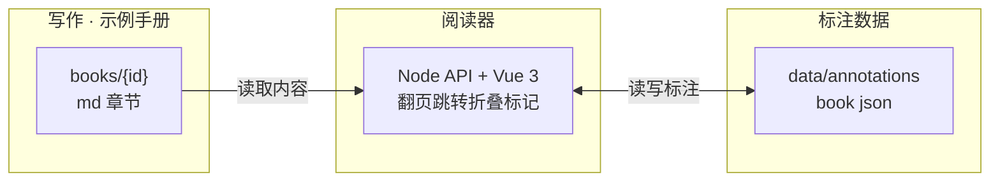

本页在 **设计** 组（仅实现透镜）。讲内容、阅读器、标注如何分离。产品动机见常显的 [概览](01-overview.md#problem)。

{#separation}
## 三者分离

{#why-survive}
## 为何重写后标注还在

标注以 `章节id#小节id` 为键存在 `data/annotations/`，与内容文件物理分离。只要遵守 [稳定 ID](03-format.md#stable-ids)，重生章节里同一小节保持同一 id，标注自动归位。id 消失则进入 [孤立标注](08-persistence.md#orphans)，绝不静默丢失。
